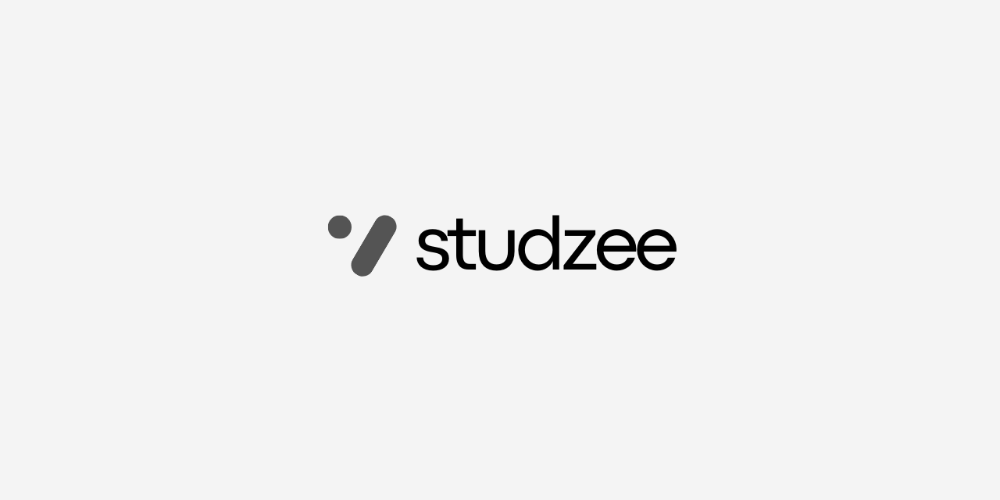

## What is Studzee?

**Studzee** is a **full-stack SaaS educational platform** designed to transform how educational content is created, structured, delivered, and consumed across multiple platforms.

It unifies **content ingestion, intelligent processing, secure delivery, and real-time engagement** into a single ecosystem. Studzee supports document-based learning at scale while laying the foundation for **AI-driven automation**, enabling both manual and fully autonomous content workflows.

---

## Who Is Studzee For?

Studzee is built for multiple stakeholders within the learning ecosystem:

- **Students & Learners**
  Consume structured educational content, summaries, and quizzes across mobile, web, and desktop platforms.

- **Educators & Content Creators**
  Upload documents, curate learning material, and manage structured educational resources.

- **Administrators**
  Oversee content pipelines, approval workflows, notifications, and platform-wide operations through a dedicated control panel.

- **Developers & Contributors**
  Work with a modular, microservice-oriented architecture designed for scalability, observability, and long-term evolution.

---

## High-Level Architecture & System Flow

Studzee follows a **distributed, service-oriented architecture** with clear separation of concerns.

### System Flow Overview

1. **Client Applications** (Mobile, Website, Desktop) interact with the Backend API.
2. **Backend (API)** handles:

   - Authentication & authorization
   - Content management
   - Caching and persistence
   - Orchestration of downstream services

3. **Notification Service** operates asynchronously:

   - Push notifications (Expo)
   - Transactional emails

4. **Storage & Caching Layers**

   - MongoDB / PostgreSQL for persistence
   - Redis for high-performance caching
   - Object storage for uploaded assets

5. **Future AI & Processing Services**

   - Content validation
   - Structuring
   - Quiz & summary generation
   - External data ingestion (PDFs, web sources)

Each service is independently deployable, enabling **fault isolation, horizontal scaling, and controlled rollouts**.

---

## Service Responsibilities & Boundaries

Clear responsibility boundaries ensure maintainability and scalability.

### BACKEND (API)

- Core business logic
- Content lifecycle management
- Caching strategy and orchestration
- Secure authentication via Clerk
- Integration point for AI and processing services

### NOTIFICATION Service

- Push notification delivery
- Transactional email handling
- Event-driven communication only
- **No business logic or data ownership**

### CLIENT APPLICATIONS

- Mobile, Web, and Desktop clients
- Content consumption and interaction
- Platform-specific UI/UX
- Authentication handled centrally via Backend

### Future SERVICE Layer (Planned)

- Dedicated services for:

  - PDF text extraction
  - Web scraping
  - Additional ingestion pipelines

- Designed to be **isolated, retryable, and failure-resilient**

---

## Expanded Roadmap: Agentic AI System

> **Current State:**
> Content is manually uploaded and structured by administrators.

### Planned Agentic AI Capabilities

The upcoming **Agentic AI system** will be responsible for **content intelligence and automation**, including:

- Content validation and structuring
- Automatic quiz generation
- Intelligent summaries
- Metadata enrichment and categorization

### AI Workflows

The AI system will operate through **two primary workflows**:

#### 1. PDF-Based Workflow

- Accepts large batches of PDFs (200+)
- Extracts raw text using a dedicated extraction service
- Analyzes extracted content
- Structures learning material
- Generates summaries and quizzes

#### 2. Web-Based Workflow

- Accepts external links
- Scrapes relevant educational content
- Processes and structures extracted data
- Generates learning artifacts (content, quizzes, summaries)

### Service-First Design

- PDF extraction and web scraping will live in **separate services**
- Enables:

  - Independent scaling
  - Fault isolation
  - Easier recovery and retries

- Additional ingestion services can be added without impacting core systems

All AI logic will reside in the upcoming `Agent` folder.

---

## Deployment Strategy & Infrastructure Panels

Studzee supports **two distinct deployment panels**, designed for flexibility and cost optimization.

### Panel 1: Free / Community Deployment

Used for testing, development, and early access environments.

- Render
- MongoDB Atlas
- Neon PostgreSQL
- Managed Redis providers
- Docker-based deployments

This panel prioritizes **cost efficiency and rapid iteration**.

### Panel 2: Production-Grade AWS Deployment

A fully managed, enterprise-ready infrastructure built on AWS:

- Terraform-based infrastructure pipelines
- Load balancing and auto-scaling
- Secure networking and isolation
- Domain configuration via Route 53
- High availability and observability

This panel is optimized for **performance, reliability, and scale**.

---

## Website & Public Access

- 🌐 **Official Website:** `https://studzee.in`
- Domain management and DNS are handled through AWS Route 53 for production deployments.

---

## Minor Documentation Notes

- Folder `VERSION` and `BRANCH` values are tied to automated deployment workflows.
- Production pushes trigger redeployment of all listed services.
- Always validate changes locally before pushing to production branches.

---

## Testing, Containerization & Local Orchestration

All Studzee services are designed with **production-readiness** as a first-class concern.

### Testing Strategy

Each service includes:

- Unit and integration testing
- Environment-specific configurations
- Automated test execution in CI pipelines

Testing ensures service stability, contract safety, and confidence during deployments.

### Containerization

- Every service is packaged as an **independent Docker image**
- Dockerfiles are optimized for:

  - Reproducible builds
  - Minimal runtime footprint
  - Clear separation between build and runtime stages

### Local Development & Orchestration

- **Docker Compose** is used for:

  - Local service orchestration
  - End-to-end testing
  - Simulating production-like environments

- Developers can run the entire ecosystem locally without external dependencies.

This approach enables fast iteration while maintaining parity with production environments.

---

## Future Infrastructure: Kubernetes & AWS (EKS)

Once the **core Studzee platform is fully stabilized**, all services will transition to a **unified cloud-native deployment model**.

### Kubernetes-Based Architecture

- All services will be deployed as containers in **AWS Elastic Kubernetes Service (EKS)**
- Kubernetes will handle:

  - Service discovery
  - Horizontal scaling
  - Rolling updates
  - Fault tolerance and self-healing

### Complete Docker Orchestration

Studzee will operate as a **fully container-orchestrated application**, where:

- Each microservice is independently deployable
- Failures are isolated
- Scaling policies are service-specific
- Infrastructure changes are managed declaratively

This evolution ensures long-term scalability, resilience, and operational clarity.

---

## Mobile Application Status

### Android Application (v1)

- The **first version of the Studzee Android app** is nearing completion
- 📱 **Planned Release:** Google Play Store (v1)
- The initial release will focus on:

  - Content consumption
  - Notifications
  - Core learning workflows

Future releases will incrementally introduce advanced features as the platform evolves.

---

## Why This Matters

These design decisions ensure that Studzee:

- Scales seamlessly from development to production
- Maintains strong reliability guarantees
- Supports rapid experimentation without compromising stability
- Is future-proofed for enterprise-grade deployments
