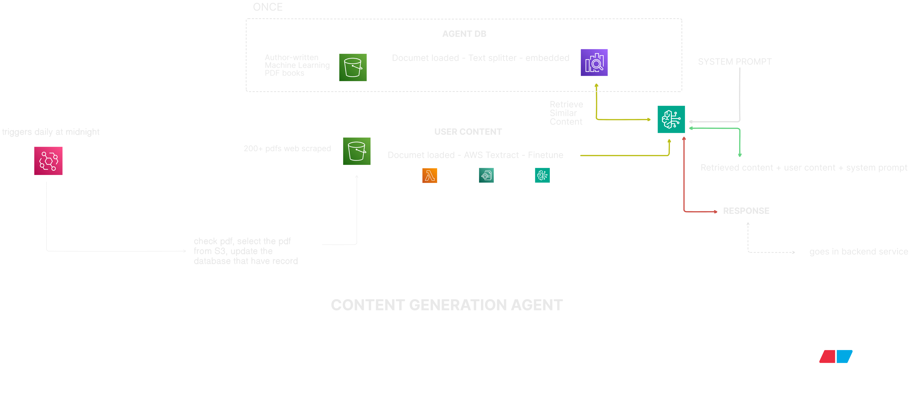

# Content Generation Agent

A retrieval-augmented content generation system that processes large volumes of PDFs, converts them into searchable embeddings, and generates context-aware responses for automated backend services.

## Architecture Overview

The agent operates through two parallel knowledge streams:

### 1. Agent Knowledge Base

**Purpose:** Static reference source for foundational knowledge

**Source:** Author-written Machine Learning PDF books

**Pipeline:**

- Document loading
- Text splitting into chunks
- Vector embedding generation
- Storage in Agent DB

**Frequency:** One-time initialization

### 2. User Content Pipeline

**Purpose:** Dynamic knowledge updates for domain awareness

**Source:** 200+ PDFs scraped from web sources

**Storage:** AWS S3

**Automation:**

- Daily trigger at midnight
- S3 bucket verification for new PDFs
- Database tracking to prevent duplicate processing

**Processing Flow:**

1. PDF selection from S3
2. Text extraction via AWS Textract
3. Data cleaning and transformation
4. Embedding enrichment
5. Storage in User Content Vector Store
6. Content generation pipeline entry

## Retrieval and Generation Flow

**Step 1: Query Embedding**

- User input converted to vector representation

**Step 2: Similarity Search**

- Retrieval from Agent DB
- Retrieval from User Content DB

**Step 3: Prompt Assembly**

```
System Prompt + Retrieved Knowledge + User Input
```

**Step 4: LLM Inference**

- Combined context sent to language model
- Response generation

**Step 5: Backend Delivery**

- Final output delivered to backend service

## System Workflow

Refer to the architecture diagram for complete system visualization:



## Key Features

- Dual-vector database architecture for static and dynamic knowledge
- Automated daily content ingestion
- AWS Textract integration for reliable PDF processing
- Deduplication tracking for efficient storage
- Retrieval-augmented generation for accurate responses
- Automated backend service integration

## Technology Stack

- Vector Database: Agent DB and User Content DB
- Cloud Storage: AWS S3
- Text Extraction: AWS Textract
- Processing: Daily scheduled jobs
- LLM Integration: Prompt-based generation

## Workflow Components

**ONCE (Initialization):**

- Agent DB setup with ML reference materials

**DAILY (Automation):**

- Web scraping of 200+ PDFs
- S3 storage
- Automated processing pipeline
- Database updates
- Content generation

**ON-DEMAND (User Request):**

- Vector similarity search
- Context retrieval
- LLM-based generation
- Response delivery

## License

This project is part of the Studzee platform. Refer to the main repository for license information.
